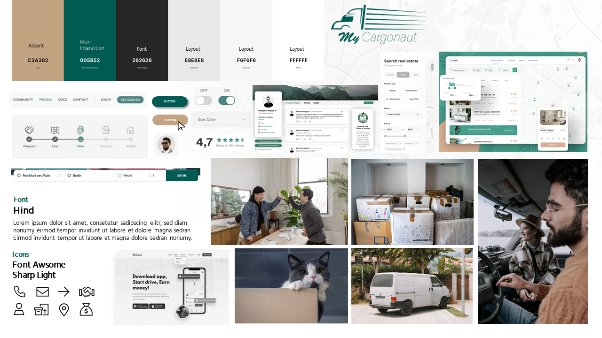

## Style Guide

Das gesamte CSS sollte, soweit möglich, in die Datei App.css geschrieben und kommentiert werden. Diese befindet sich hier: [`../../frontend/src/App.css`](../../frontend/src/App.css). 

Oft verwendete Werte wie Farben, Schatten usw. können als Variablen definiert werden. Dies ermöglicht eine konsistente Verwendung dieser Werte im gesamten CSS und vereinfacht das Ändern oder Aktualisieren dieser Werte später.

Auserdem wird React Bootstrap für die Entwicklung der Benutzeroberfläche verwendet.

Siehe auch: [`Moodboard`](./kms-moodboard.PNG), [`Wireframes & Mockup`](./kms-wireframe-mockup.pdf) und [Wireframes & Mockup in Figma](https://www.figma.com/file/z0Ur6Azn4LpfEnmPuJUhya/KMS-CARGONAUT?type=design&node-id=0%3A1&mode=design&t=vFpeCPodi69RN6UR-1) (bessere Ansicht)

### Farben
- #C3A382 - Lion: Verwendung für Akzente.
- #005B52 - Brunswick green: für Akzente (Hauptfarbe).
- #262626 - Eerie black: Verwendung für Schrift.
- #E8E8E8 - Platinum: Verwendung für die Organisation des Layouts.
- #F6F6F6 - Seasalt: Verwendung für die Organisation des Layouts.
- #FFFFFF - White: Verwendung für die Organisation des Layouts.

### Font
- Die Schriftart "Hind" von Google Fonts wird für alles verwendet (nicht lokal eingebunden - siehe index.html).
- [Google Font Hind](https://fonts.google.com/specimen/Hind?query=hind)

### Icons
- Es werden Font Awsome Sharp Light Icon verwendet (ist lokal eingebunden)
- Kann verwendet werden durch `<i className="icon-[IconName]"></i>`
- [Font Awesome Sharp Light](https://fontawesome.com/search?s=light&f=sharp&o=r)

### Formen

- Verwendung von minimalistischem Flat Design mit abgerundeten Ecken.
- **Interaktionselemente** wie Buttons und Toggles sollen einen Schatten haben, während **alles** andere flach ist.
